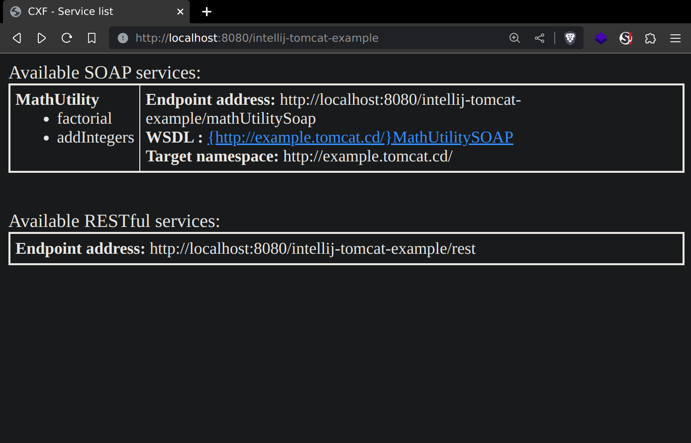

# intellij-tomcat-example
This is an example project to setup SOAP and REST web services
using Apache Tomcat 10 and Apache CXF on IntelliJ IDEA Community
Edition.

## Project Setup on IntelliJ IDEA
This README describes how to setup this project in IntelliJ IDEA 
Community Edition.

### Prerequisites
- Git
- IntelliJ IDEA Community Edition
- Apache Tomcat 10

### Getting the code
The first step is to clone this repo. To do that we can execute the
following command on the terminal:
```bash
git clone https://github.com/al3x-13/intellij-tomcat-example.git
```


### Setting up the environment
1. Open the project in IntelliJ by clicking **Open** and then select the path of the repo.


2. Click **Trust Project**.


3. Install **Smart Tomcat** plugin. Go to **File > Settings > Plugins**, search for *'Smart Tomcat'*, 
click **Install** and then **Apply**.


4. Setup Tomcat server. Go to **File > Settings > Tomcat Server**, click on the 
**+** icon and select the path of the Tomcat 10 installation. At the end click **Apply**.


### Running the Application (Tomcat Server)
1. Create Tomcat server run configuraion. Click in the top-right corner of the IDE where it says 
**Current File** and then **Edit Configurations... > New run... > Smart Tomcat**.


2. In this window set the **Name** to your desire and the **Tomcat server** option (from the dropdown)
to the server version you specified previously.


3. Run the Tomcat server. To run it you just need to press the **Run** icon in the top-right corner.


4. Verification. To verify that the server ran successfully just open a browser and paste the url 
displayed on the IDE in the url bar.


**DONE**